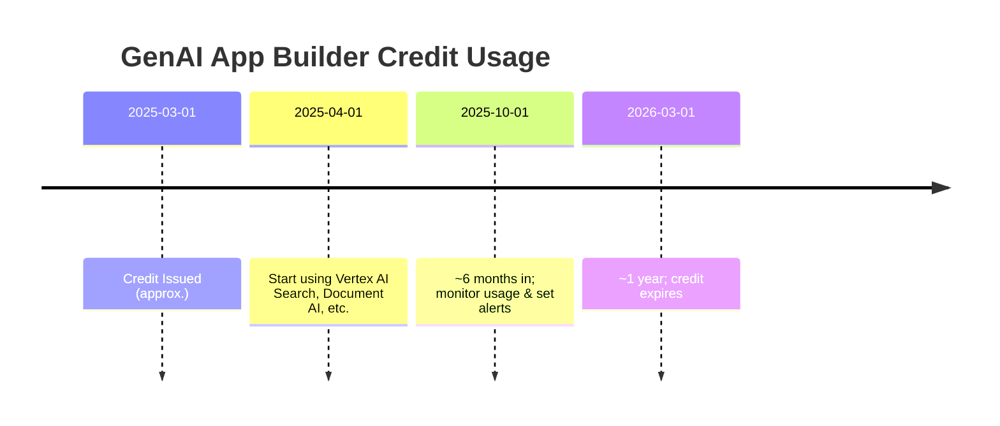

# Executive Summary  
Generative AI App Builder (GenAI App Builder) is a Google Cloud orchestration layer that simplifies building search and conversational AI apps. Google offered a one-time “Trial credit for GenAI App Builder” (e.g. ~$1,000, shown as ~₹91,785) to let developers explore *search-based* AI services【71†L90-L99】. This specialized credit **only applies** to Vertex AI Search (the “AI Applications” search experience) and related services (e.g. Grounded Generation for Retrieval-Augmented Generation)【77†L82-L86】【40†L528-L537】. It cannot be used with the general-purpose Gemini API or unrelated services; any usage outside the prescribed scope is billed normally. The credit typically expires one year after issuance (reports indicate ~1 year validity【24†L169-L177】). Users should monitor usage carefully – only eligible calls will draw on this credit【77†L82-L86】 – and set up Cloud Billing budgets and alerts to avoid unexpected charges【91†L276-L284】. The sections below detail the credit’s terms, scope, and practical use, with official references and examples.  

【73†embed_image】 *Illustration: GenAI App Builder enables building AI search and chat apps with Google Cloud’s generative AI (Source: Google Cloud)*

## Credit Documentation and Terms  
The GenAI App Builder credit is **not** documented on a dedicated public page, but Google Cloud’s materials hint at its scope. Official Vertex AI Search pricing pages emphasize that new customers get “$300 in free credits” for general use【35†L402-L410】, **but** the GenAI App Builder credit is a separate promotion for specialized use. Google Support confirms this credit *“will only be applied to Vertex AI Search services”*【77†L82-L86】, and community sources note it appeared automatically in GCP consoles around Spring 2025. 

**Eligibility and Redemption:** There is no application process – the credit typically appears on eligible Google Cloud billing accounts automatically. You do not “redeem” it with a code; rather, it shows up as a balance under *Billing → Credits* in the Cloud Console (open the Credits page for your billing account as described in Google’s documentation【67†L266-L274】). The “Trial credit for GenAI App Builder” entry displays the original amount, remaining balance, and any expiration date. For example, one user saw “Original value: ₹89,978.76 (expires in 1 year)” on their Credits page【24†L169-L177】.  

**Expiration:** While Google has not publicly published the exact terms, user reports consistently indicate a ~1-year expiration (e.g. credit granted in early 2025 expires in early 2026)【24†L169-L177】. It’s prudent to assume the credit must be used before that date. The billing console often shows an “expires on” date next to the credit name. 

**Limits and Billing Rules:** The credit applies on a *per-SKU* basis. All usage charged to covered SKUs will first consume this credit. Google’s SKU documentation lists the specific services under the “Vertex GenAI Offer 2025,” including Vertex AI Search (Enterprise Search), Grounded Generation, Document AI OCR/layout, Ranking API, etc.【53†L1333-L1342】【55†L25-L34】. Notably, the credit **does not** cover standard Vertex AI (Gemini) model calls, Compute/Cloud Run, or general Google Cloud services. If you attempt an ineligible operation, you will be billed from your payment method. The credit also cannot be stacked with other promotional credits for the same usage; it is its own distinct balance【77†L82-L86】. 

## Eligible Services and Usage Scope  
In practice, this credit is intended for “AI Applications” use cases – primarily enterprise search and retrieval-augmented generation. Key covered services include:  

- **Vertex AI Search (Generative Search):** Create custom search apps over your data. Charges include indexing (data ingestion) and query/prediction costs. For example, search API requests (with generative answers) are billed per 1,000 requests. (Vertex AI Search SKUs under the GenAI credit include *Advance Generative Answers*, *Grounded Generation*, *Ranking*, and *Search API requests*【55†L25-L34】【56†L2542-L2550】.)  
- **Grounded Generation API:** A specialized RAG (retrieval-augmented generation) service using Gemini models. You pay model token costs plus a flat fee ($2.50 per 1,000 requests when grounding on your own data【84†L562-L570】). The credit covers these costs.  
- **Vertex AI Search / Document AI for data ingestion:** Many Gen App Builder workflows ingest PDFs/images. Some Document AI features (OCR, layout parsing) are billed through Vertex AI Search. For example, OCR of unstructured docs is $1.50 per 1,000 pages【84†L673-L681】 (after the first 1,000 pages free). This credit can cover those ingestion fees as they are part of the Vertex Search SKU group.  
- **Ranking API:** Post-retrieval ranking of document lists. Charged at $1.00 per 1,000 items ranked【84†L728-L736】. This helps improve search results and is covered by the GenAI credit.  
- **Check Grounding API:** A utility for analyzing answer grounding ($0.00075 per 1,000 tokens【84†L658-L667】). Also in the search ecosystem.  
- **Other Vertex AI Search features:** Any feature billed through the search SKUs listed in the Vertex GenAI Offer (e.g. healthcare or media search tiers) is eligible【53†L1333-L1342】【56†L2542-L2550】.  

Not covered are services like standard Vertex AI model predictions (e.g. calling Gemini via AI Studio or API), AI notebooks, Compute Engine, Cloud Storage, etc. In short, you can only spend this credit on *search/conversation* tasks within Google’s search/Gemini “AI Applications” framework【77†L82-L86】【40†L528-L537】.  

【75†embed_image】 *GenAI App Builder orchestrates search (left) and conversational (right) AI components【71†L90-L99】. The trial credit only applies to costs generated by these backend search/Gemini services.*  

## Monitoring Credit Usage in Console  
To see and track the credit in your billing account: 

1. **Open the Credits page**: In the Google Cloud Console, go to **Billing → Credits** (or navigate directly to `console.cloud.google.com/billing/credits`). Select your billing account to view all credits associated with it【67†L266-L274】. The “Trial credit for GenAI App Builder” should appear with its original and remaining amounts. 
2. **Verify scope**: Click the credit entry (if possible) to view details or terms. It typically will note “Certain usage; see terms of promotion,” indicating the restrictions. Unfortunately Google doesn’t publicly show all details here, but the above docs confirm the scope.  
3. **Use Budgets & Alerts**: Set a budget on your billing account or specific projects to get email alerts as you spend through this credit【91†L276-L284】. For example, create a budget for $100,000 and alert at 50%, 90% of spend to notify before the credit is exhausted. *Caution*: budgets only alert you – they won’t stop usage【91†L276-L284】.  
4. **Review Cost Reports**: In **Billing → Reports (Cost Table)**, enable “Credit Type” and “Credit Name” columns【67†L297-L305】. Filter for “Promotions” under Credits. This will show how much of your costs are covered by the GenAI credit vs. actual billing. You can also export billing data to BigQuery for detailed analysis. 
5. **Console quotas**: The GenAI credit has no special API quota; it uses the same quotas as underlying APIs. However, remember that Vertex AI Search has a *free tier* (10,000 queries per month)【40†L522-L529】. Use those free queries first and let credit cover the rest.  
6. **Cleanup**: After prototyping, delete any AI Search indexes, models, or projects to avoid storage/training charges.  The credit only covers *query/usage* fees; leftover resources may incur later costs on your account. 

Official docs on budgets and cost monitoring can guide these steps【67†L297-L305】【91†L276-L284】. It’s recommended to periodically check the Credits page to watch the balance decline as you consume it. 

## Cost Examples & How Far ₹91,785 Goes  
To illustrate credit usage, consider rough costs (all prices are USD, converted to ₹ at ~₹82/USD). With ₹91,785 (~$1,120) credit, approximate usage is:  

| Service / API                        | Price per 1,000 units (USD)【84†L562-L570】【84†L673-L681】【84†L728-L736】 | ~Price per 1,000 (₹) | Units covered by ₹91,785 credit (approx) |
|--------------------------------------|-----------------------------------|--------------|------------------------------------|
| **Vertex AI Search query (standard)**| ~$2.00 / 1,000 requests (*Media Search tier*)【87†L442-L445】| ~₹164   | ~~560,000 queries (assuming $2) |
| **Grounded Generation (own data)**   | $2.50 / 1,000 requests【84†L562-L570】 | ~₹205   | ~~447,000 requests   |
| **Document AI OCR (text pages)**     | $1.50 / 1,000 pages【84†L683-L692】  | ~₹123   | ~~745,000 pages    |
| **Document AI Layout/Entities**      | $10.00 / 1,000 pages【84†L711-L719】 | ~₹820   | ~~112,000 pages   |
| **Ranking API (docs per query)**     | $1.00 / 1,000 docs【84†L748-L756】   | ~₹82    | ~~1,118,000 docs  |
| **Check Grounding (tokens)**         | $0.00075 / 1,000 chars【84†L658-L667】| ~₹0.062 | ~~≈1.48 billion characters |
| **Gemini model (1.5B) inference**    | $0.60 / 1,000 tokens (flash) [*]    | ~₹49    | ~~22.8 million tokens (if allowed) |

(*The last row is **not** eligible under this credit; included here for comparison.)  

For example, using only Vertex AI Search queries at $2/1k (~₹164/1k), ₹91,785 would cover ~560 million queries. A RAG app making 10,000 grounded queries (with 2,500-token prompts) would cost about $6.9 per 1k【84†L599-L607】, so the entire credit could support ~163,000 such queries. Using Document AI to OCR 1 million pages (beyond the free tier) would cost ~$1,500 (₹123k), roughly covering 750k pages. 

These estimates assume heavy use of the credit on covered SKUs. Actual apps may mix and match calls (searching docs, then generating answers, etc.). The above pricing is from official docs【84†L562-L570】【84†L683-L692】【84†L748-L756】. Notably, if a usage is *not* covered (e.g. standard Gemini text generation outside Grounded API), it would draw from other credits or charge your card. 

## Maximizing Value & Avoiding Surprises  
- **Use Free Tiers First:** Most Vertex AI Search features have small free quotas (10,000 searches/month, 1,000 OCR pages)【40†L522-L529】【84†L683-L692】. Leverage those before spending the GenAI credit.  
- **Combine with $300 Free Trial:** The standard Google Cloud free trial ($300) can cover unrelated GCP costs. You effectively have two credit pools: the $300 for any service, and the GenAI credit for search/Gemini apps【35†L402-L410】【77†L82-L86】. Plan so that each credit is used in its scope.  
- **Set Budget Alerts:** Create a billing budget at or below ₹91,785 to get warnings as you spend. Remember, a budget doesn’t cap spend【91†L276-L284】 – it only alerts you. You could also use Pub/Sub notifications or Cloud Monitoring to trigger automated actions (e.g. disable billing) when you near the limit.  
- **Use Resource Quotas:** Google Cloud allows you to set quotas on API usage. For example, cap Vertex AI Search queries or Grounded Gen requests per minute to avoid runaway costs.  
- **Regularly Check the Credits Page:** Monitor the remaining balance to avoid accidental overspend. The “Credits” page shows how much is left and the expiry date (if any). If the credit is unused when it expires, any further calls will be billed fully.  
- **Clean Up Idle Resources:** Remove unneeded indexes, models, or compute instances in projects using the credit. Storage and training costs (e.g. for custom search models) are also chargeable; ensure you delete resources when done to avoid late billing on your payment method.  
- **Review Billing Reports:** Use the cost table report (with filters for “Promotions” credit type) to verify that consumption is being applied correctly to the GenAI credit【67†L297-L305】. If you see unexpected charges, double-check service SKUs against the credit’s scope. 

In summary, treat this credit as a one-year “budget” specifically for Vertex AI Search/Grounded Gen workloads. Plan experiments accordingly and watch your spend. 

## Timeline and Flow of Credit Usage  


```mermaid
flowchart LR
    A[Sign in to Google Cloud Console] --> B[Open Billing → Credits];
    B --> C{Is "GenAI App Builder" credit present?};
    C -- No --> Z[No eligible credit; normal billing applies];
    C -- Yes --> D[Verify credit balance and expiry];
    D --> E[Enable needed APIs (Vertex AI Search, Document AI)];
    E --> F[Build GenAI App (index data, run search/RAG queries)];
    F --> G[Monitor spend];
    G --> H{Spend nearing credit limit?};
    H -- Yes --> I[Receive budget alerts / limit usage];
    H -- No --> F;
    I --> F
```  

Use Google’s billing and budget docs to guide monitoring steps【67†L266-L274】【91†L276-L284】. By following this flow – activating and checking the credit, using only covered services, and setting alerts – you can safely explore GenAI App Builder without surprise charges.

**Sources:** Official Google Cloud documentation on generative AI pricing and billing【84†L562-L570】【84†L683-L692】【84†L748-L756】【77†L82-L86】【67†L266-L274】【91†L276-L284】; and community reports/support posts summarizing the GenAI App Builder trial credit【24†L169-L177】【77†L82-L86】. Where official details are absent, we’ve indicated typical behavior (e.g. ~1-year expiration) based on user reports【24†L169-L177】.