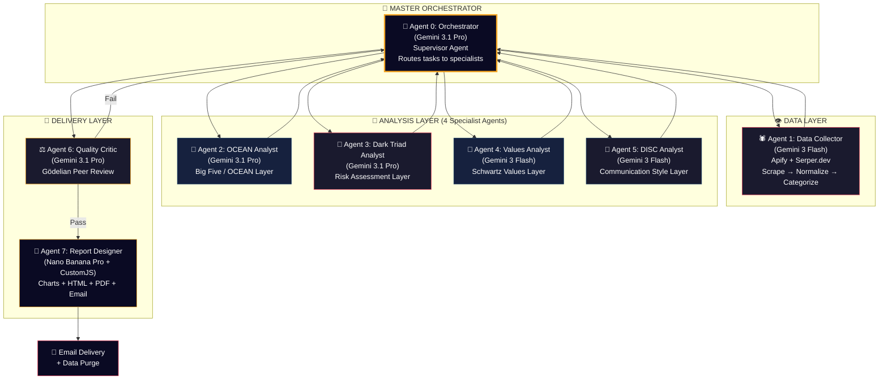

# Agentic Psy Profiler OS — Complete Blueprint v2.0

> **By Kunaya Lab** | Multi-Agent n8n Automation Template
> Deep Psychology × Agentic AI × Multi-Modal Intelligence

---

## Executive Summary

A packaged n8n agentic workflow system using **7 specialized AI agents** (LangChain-powered) that scrape public social media data, run 4-layer deep psychological analysis through multi-modal triangulation, and deliver premium classified-intelligence-style PDF reports. Targets: **Hiring**, **Sales**, **Dating**.

### Tech Stack (Confirmed)

| Component | Technology | Purpose |
|-----------|-----------|---------|
| **Orchestration** | n8n (self-hosted) | Workflow engine |
| **Agent Framework** | LangChain (via n8n AI Agent nodes) | Multi-agent orchestration |
| **Analysis Brain** | `gemini-3.1-pro-preview` | Deep reasoning, 4-layer synthesis |
| **Fast Processing** | `gemini-3-flash-preview` | Map phase, tagging, categorization |
| **Report Visuals** | `gemini-3-pro-image-preview` (Nano Banana Pro via Vertex AI) | AI-generated report graphics |
| **Data Scraping** | Apify (BYOK) | LinkedIn, X/Twitter, Instagram |
| **Fallback Search** | Serper.dev | OSINT when scraper fails |
| **Charts** | QuickChart.io (dark theme) | Radar, bar, heatmap charts |
| **PDF Engine** | CustomJS HTML-to-PDF | Premium report generation |
| **Credits DB** | Local SQLite (via n8n Code node) | Lightweight, no external DB |
| **Email** | SMTP / Gmail / SendGrid (BYOK) | Report + status delivery |

---

## What Makes This Different

| Feature | Crystal ($49/mo) | Humantic AI ($180/mo) | **Psy Profiler OS (LTD $29-149)** |
|---------|---|---|---|
| Model | SaaS | SaaS | **BYOK self-hosted** |
| Framework | DISC only | DISC + Big Five | **4-Layer (OCEAN + Dark Triad + Schwartz + DISC)** |
| Visual AI | ❌ | ❌ | **✅ Profile pic + image analysis** |
| Temporal | ❌ | ❌ | **✅ Posting time patterns** |
| Persona vs Self | ❌ | ❌ | **✅ Sentiment Delta** |
| Multi-Agent | ❌ | ❌ | **✅ 7 specialized LangChain agents** |
| AI-Generated Report Graphics | ❌ | ❌ | **✅ Nano Banana Pro** |
| Privacy | Vendor holds data | Vendor holds data | **User owns everything** |
| Resume + Custom Data | ❌ | ❌ | **✅ All-in-one input** |

---

## Resolved Decisions

| Decision | Answer |
|----------|--------|
| Nano Banana Pro model ID | `gemini-3-pro-image-preview` via GCP Vertex AI API |
| n8n URL | `http://localhost:5678` (self-hosted on local system) |
| Report seal/badge | Static Kunaya Lab logo asset (provided by user) |
| Credit storage | Local SQLite (no Supabase) |
| Resume/custom data | All-in-one in v1.0 |
| Multi-agent framework | LangChain via n8n AI Agent Tool nodes |

> [!WARNING]
> **Marketing Language**: Never claim "100% accuracy." Use: *"The most comprehensive AI persona analysis available."*

> [!NOTE]
> **Agent Personas & Production Prompts**: See [agent_personas.md](file:///home/kaikuna0006/.gemini/antigravity/brain/868be1f7-33ad-4c86-8443-3b8e3a4dbf59/agent_personas.md) for all 7 specialized agent identities (NEXUS, PHANTOM, ATLAS, EREBUS, PRISM, VECTOR, ORACLE, CIPHER) with psychology-backed cognitive framing and production-ready system prompts.

---

## Multi-Agent Architecture (LangChain in n8n)

This is the core innovation. Instead of one monolithic workflow, the system uses **7 specialized AI agents** that communicate through n8n's **AI Agent Tool node** (LangChain-backed Supervisor-Worker pattern).



### Why 7 Agents Instead of 1?

| Aspect | Single Agent | **7-Agent System** |
|--------|-------------|-------------------|
| Token cost | All data in 1 call = expensive | Each agent sees only its data slice |
| Accuracy | Context confusion at scale | Each specialist is laser-focused |
| Speed | Sequential bottleneck | Analysis Layer runs **in parallel** |
| Reliability | 1 failure = total failure | Agents retry independently |
| Debugging | Hard to isolate issues | Each agent has its own execution log |
| Model routing | Same model for everything | Flash for simple tasks, Pro for deep reasoning = **60% cost savings** |

---

## Agent Specifications

### Agent 0: The Orchestrator (Supervisor)

**n8n Node**: AI Agent (LangChain) → Tool Agent with sub-agent tools
**Model**: `gemini-3.1-pro-preview` (needs deep reasoning to route tasks)
**Role**: Master coordinator. Receives validated input, delegates to specialists, collects results, passes to Quality Critic.

**System Prompt**:
```
You are the Master Orchestrator of the Psy Profiler system. Your role:
1. Receive the normalized data package from Agent 1 (Data Collector)
2. Distribute the data to 4 specialist agents IN PARALLEL:
   - Agent 2 (OCEAN), Agent 3 (Dark Triad), Agent 4 (Values), Agent 5 (DISC)
3. Collect all 4 analysis results
4. Package them into a unified profile and send to Agent 6 (Quality Critic)
5. If Critic fails the report, incorporate feedback and re-run failed layers
6. On pass, forward to Agent 7 (Report Designer)

RULES:
- Never skip any layer. All 4 must complete.
- If a specialist returns "Inconclusive" for >50% of traits, flag it.
- Maximum 2 retry cycles with the Critic.
- Track token usage per agent for cost reporting.
```

**Tools Available** (via AI Agent Tool nodes):
- `call_data_collector` — triggers Agent 1
- `call_ocean_analyst` — triggers Agent 2
- `call_dark_triad_analyst` — triggers Agent 3
- `call_values_analyst` — triggers Agent 4
- `call_disc_analyst` — triggers Agent 5
- `call_quality_critic` — triggers Agent 6
- `call_report_designer` — triggers Agent 7

---

### Agent 1: Data Collector (The Eyes)

**n8n Node**: AI Agent (LangChain) with HTTP Request tools + Code tools
**Model**: `gemini-3-flash-preview` (routing logic only, doesn't need deep reasoning)
**Trigger**: Called by Orchestrator as a sub-workflow tool

**Responsibilities**:
1. Detect platform from URL (LinkedIn / X / Instagram) OR parse resume / custom data
2. Call the correct Apify actor via HTTP Request
3. If scrape fails → Serper.dev fallback → Google mentions fallback → Error
4. Normalize all data to unified schema
5. Categorize posts into buckets (High Emotion / Business Logic / Personal Vulnerable)
6. Extract temporal patterns (posting hours, frequency, late-night ratio)
7. Download top 5 most-engaged images for visual analysis
8. Return structured data package to Orchestrator

**Platform → Apify Actor Mapping**:

| Platform | Actor | Config |
|----------|-------|--------|
| LinkedIn | `apify/linkedin-profile-scraper` | No-cookie variant, posts + articles |
| X/Twitter | `apidojo/tweet-scraper` (Tweet Scraper V2) | Tweets + replies, last 2 years |
| Instagram | `apify/instagram-scraper` | Posts + captions + images |
| Resume | Code Node (text extraction) | PDF/DOCX parsing via built-in |
| Custom Text | Direct pass-through | Already normalized |

**Fallback Chain**:
```
Apify scrape → IF empty → Serper.dev "{name} site:{platform}"
  → IF still empty → Serper.dev "{name} {bio keywords}"
    → IF still empty → Error: "Target in Stealth Mode 🕵️"
```

**Output Schema**:
```json
{
  "profile": {
    "name": "...", "bio": "...", "profile_image_url": "...",
    "platform": "twitter", "follower_count": 0, "following_count": 0
  },
  "posts": [{
    "text": "...", "timestamp": "ISO-8601",
    "type": "original|reply|repost",
    "media_urls": ["..."],
    "engagement": { "likes": 0, "replies": 0, "reposts": 0 },
    "hour_of_day": 3, "day_of_week": "Monday"
  }],
  "images_base64": ["top_5_engaged_images"],
  "categories": {
    "high_emotion": [...], "business_logic": [...], "personal_vulnerable": [...]
  },
  "temporal": {
    "avg_posting_hour": 14.2, "late_night_ratio": 0.12,
    "posting_frequency": "daily", "weekend_ratio": 0.3
  },
  "meta": {
    "total_posts": 150, "reply_ratio": 0.35,
    "data_source": "apify|serper|resume|custom",
    "date_range": "2024-03-12 to 2026-03-12"
  }
}
```

---

### Agent 2: OCEAN Analyst (Layer 1 — The Core)

**Model**: `gemini-3.1-pro-preview` (needs deep reasoning)
**Input**: Full data package from Agent 1
**Uses Map-Reduce** for token efficiency

**MAP Phase** (5 posts per batch, using `gemini-3-flash-preview` via sub-calls):
```
For each batch of 5 posts, extract:
- Emotional_Tone, Confidence_Level, Topic_Category
- Social_Positioning, Linguistic_Markers
- If images present: Image_Subject, Image_Setting, Visual_Presentation
Return JSON tags only.
```

**REDUCE Phase** (`gemini-3.1-pro-preview`):
```
From aggregated tags across {count} posts over {timeframe}:

Score each OCEAN dimension (1-100) with confidence %:
1. Openness — evidence from topic diversity, curiosity markers, creative language
2. Conscientiousness — evidence from scheduling patterns, detail orientation, follow-through
3. Extraversion — evidence from engagement frequency, group vs solo content, energy indicators
4. Agreeableness — evidence from reply tone, conflict handling, empathy markers
5. Neuroticism (Emotional Stability) — evidence from mood swings, late-night posting, anxiety language

RULES:
- Every score needs ≥2 direct evidence citations with post references
- <20 posts: cap confidence at 70%. <5 posts: cap at 40%
- Include SENTIMENT DELTA: compare original post sentiment vs reply sentiment
- If insufficient data → "Inconclusive — insufficient signal" with confidence 0
```

**Output**: OCEAN scores with evidence, sentiment delta, confidence bands

---

### Agent 3: Dark Triad Analyst (Layer 2 — Risk Assessment)

**Model**: `gemini-3.1-pro-preview` (most sensitive analysis, needs top reasoning)
**Input**: Full data package + OCEAN results (for cross-reference)

```
⚠️ CRITICAL FRAMING: These are behavioral PATTERN indicators of the 
online PERSONA, not clinical diagnoses of a human being.

Analyze for three risk dimensions (score: Low/Moderate/Elevated/High):

1. MACHIAVELLIANISM INDICATORS
   - Strategic language patterns, transactional framing
   - Manipulation markers in persuasion attempts
   - Evidence: quote specific posts

2. NARCISSISM INDICATORS  
   - Self-referential language ratio (I/me vs we/us)
   - Response patterns to criticism or challenge
   - Curated vs authentic image presentation
   - Evidence: quote specific posts

3. PSYCHOPATHY INDICATORS
   - Empathy signals when others share struggles
   - Emotional range in discussions of sensitive topics
   - Risk-taking language and boundary-pushing behavior
   - Evidence: quote specific posts

CROSS-REFERENCE with OCEAN: Flag contradictions
(e.g., High Agreeableness + High Machiavellianism = potential masking)

If data is insufficient for any dimension → "Inconclusive"
```

---

### Agent 4: Values Analyst (Layer 3 — The Consumer Brain)

**Model**: `gemini-3.1-pro-preview` (deep reasoning for accurate value mapping)
**Input**: Categorized posts (especially "personal_vulnerable" bucket)

```
Rank the subject's Schwartz Value System (1=dominant, 10=least):

Power | Achievement | Hedonism | Stimulation | Self-Direction
Universalism | Benevolence | Tradition | Conformity | Security

For top 3 values, provide:
- 2+ evidence citations from posts
- How this manifests in their content themes
- {report_type}-specific insight:
  [Hiring]: What motivates them at work?
  [Sales]: What pain points resonate?
  [Dating]: What do they seek in relationships?
```

---

### Agent 5: DISC Analyst (Layer 4 — Communication Style)

**Model**: `gemini-3.1-pro-preview` (deep reasoning for nuanced communication analysis)
**Input**: Full data package

```
Score each DISC dimension (1-100) with evidence:

D (Dominance): Directive language, competitive framing, assertiveness
I (Influence): Storytelling, humor, social proof, networking behavior  
S (Steadiness): Consistency, loyalty signals, change resistance
C (Conscientiousness): Detail orientation, data citation, process focus

Primary Style: [D/I/S/C]
Secondary Style: [D/I/S/C]

TACTICAL PLAYBOOK for {report_type}:
[Hiring]: How to interview them (question style, pace)
[Sales]: How to pitch to them (lead with data vs story vs urgency)
[Dating]: How to communicate (direct vs gentle, structured vs spontaneous)
```

---

### Agent 6: Quality Critic (The Gödelian Peer Reviewer)

**Model**: `gemini-3.1-pro-preview` (needs to audit sophisticated analysis)
**Input**: Combined output from Agents 2-5

```
You are a scientific peer reviewer. Audit this persona analysis:

1. HALLUCINATION CHECK
   - Does every trait scored >50 have ≥2 supporting citations?
   - Flag unsupported claims.

2. CONTRADICTION CHECK  
   - Cross-layer conflicts? (e.g., High Extraversion + High Steadiness + Low Influence)
   - OCEAN vs Dark Triad conflicts?

3. CONFIDENCE CALIBRATION
   - With <20 posts: no trait >70% confidence
   - With <5 posts: no trait >40% confidence
   - Verify these limits are respected

4. BIAS CHECK
   - Is analysis skewed by a single viral post?
   - Is there platform bias? (LinkedIn skews professional)

5. EVIDENCE QUALITY
   - Are citations actual quotes or paraphrases?
   - Do citations support the claimed trait?

Return: { "pass": true/false, "overall_confidence": "high|medium|low",
         "issues": [...], "required_fixes": [...] }
```

**Logic**: If fails → Orchestrator re-runs only the failed layers with critic feedback injected. Max 2 retries → deliver with "Limited Confidence" disclaimer.

---

### Agent 7: Report Designer (The Prize)

**Model**: Nano Banana Pro (for graphics) + Code nodes (for HTML/PDF)
**Input**: Validated analysis from all layers

**Responsibilities**:
1. Generate QuickChart.io URLs for dark-themed charts
2. Use static Kunaya Lab logo for report header (no AI generation needed)
3. Assemble premium HTML report with classified-document aesthetic
4. Convert to PDF via CustomJS
5. Send email with progressive status updates
6. Purge all intermediate data

**Charts Generated**:
- **OCEAN Radar** (spider chart, dark navy background, crimson + gold)
- **Dark Triad Risk Matrix** (horizontal bar, color-coded Low=green → High=red)
- **Schwartz Values Ring** (polar area chart, gold gradient)
- **DISC Quadrant** (4-quadrant scatter, highlighted primary/secondary)
- **Temporal Heatmap** (posting hours × days of week)

**Report Template Design**:
- Colors: Dark navy `#0a0a23`, Crimson accent `#e94560`, Gold highlights `#f5a623`, Dark card `#16213e`
- Typography: Courier New for headers (military brief), Inter for body
- Header: Static Kunaya Lab logo (provided asset, black/gold aesthetic)
- Watermark: "CLASSIFIED — PERSONA ANALYSIS" diagonal
- Sections: Profile Summary → OCEAN Radar → Dark Triad Risk → Values → DISC → Sentiment Delta → Temporal Patterns → Tactical Recommendations → Legal Disclaimer
- Design elements: Redacted-style black bars, grid lines, confidence meters

**Progressive Email Updates** (3 emails per analysis):
1. *"🎯 Mission Accepted: Analysis of @{handle} initiated"*
2. *"📊 Data Collection Complete: {count} artifacts recovered. Analysis in progress."*
3. *"🔐 Mission Complete: Your classified report is attached."*

---

## Input Types (All-in-One v1.0)

| Input | Method | Handling |
|-------|--------|----------|
| Social Media URL | Webhook/Form field | Apify → normalize |
| Resume (PDF/DOCX) | File upload via Form | Code node text extraction → normalize |
| Custom Text | Textarea in Form | Direct normalize, skip scraping |
| Multiple URLs | Comma-separated | Sequential scraping, merged analysis |

---

## n8n Workflow Structure

### Workflow 1 — Intake & Validation

```
n8n Form Trigger / Webhook POST
  → Code Node: Validate inputs (URL/email/type/API keys)
  → Code Node: SQLite credit check & deduction
  → IF: credits > 0
    → YES: Email "Mission Accepted" → Execute Workflow 2
    → NO: Email "Credits Depleted" with Gumroad link
```

### Workflow 2 — Master Pipeline (Agent Orchestration)

```
When Called by Another Workflow (trigger)
  → AI Agent Node: ORCHESTRATOR (Gemini 3.1 Pro + LangChain)
    ├── Tool: Agent 1 Sub-Workflow (Data Collection)
    ├── Tool: Agent 2 Sub-Workflow (OCEAN)
    ├── Tool: Agent 3 Sub-Workflow (Dark Triad)
    ├── Tool: Agent 4 Sub-Workflow (Values)
    ├── Tool: Agent 5 Sub-Workflow (DISC)
    ├── Tool: Agent 6 Sub-Workflow (Quality Critic)
    └── Tool: Agent 7 Sub-Workflow (Report Designer)
```

### Workflows 3-8 — Individual Agent Sub-Workflows

Each agent is a **separate n8n sub-workflow** exposed as a tool:
- Triggered via "When Called by Another Workflow"
- Has its own AI Agent node with specialized system prompt
- Has its own tools (HTTP Request, Code nodes, etc.)
- Returns structured JSON to the Orchestrator

### Workflow 9 — Error Handler

```
Error Trigger (catches all workflow failures)
  → Switch: Error type
    → Private Account → "Mission Failed: Stealth Mode 🕵️" email
    → Scraper Banned → Retry + fallback chain
    → Safety Block → Re-prompt with persona framing
    → Invalid API Key → "Authentication Failed" email
    → Rate Limit → Queue + exponential backoff
    → Unknown → Generic email + SQLite error log
```

---

## Blind Spots & Improvements (My Analysis)

### 🔴 Critical Items You Were Missing

1. **Rate Limiting**: Cap at 5 concurrent analyses per user per hour. Apify charges premium proxy costs at scale.

2. **Data Purging (GDPR)**: After PDF is emailed, delete all scraped data from n8n execution history. Only retain: email, timestamp, credit transaction.

3. **Image Base64 Limits**: Limit to top 5 most-engaged images. 50 Instagram images as base64 will blow the API request.

4. **Non-Determinism**: Set `temperature: 0.1` for all analysis calls. Include disclaimer: *"Scores may vary ±10 points between analyses."*

5. **LinkedIn Fragility**: LinkedIn scrapers break frequently. Need primary + backup actor + Serper.dev fallback + clear customer documentation.

6. **Multi-Language**: Add language detection before analysis. Instruct Gemini to analyze in detected language.

### 🟡 Enhancements Beyond Your Original Plan

7. **Cost Estimation Before Run**: Show estimated cost based on post count before executing.

8. **Confidence Bands**: Display "Openness: 72 (±15, Confidence: Medium)" — turns uncertainty into scientific rigor.

9. **Webhook Callback**: Optional `callback_url` for B2B/CRM integration. POST JSON results to their endpoint.

10. **Quick vs Deep Differentiation**:

| | Quick (~30s, ~$0.03) | Deep (~3-5min, ~$0.15) |
|---|---|---|
| Posts | 20 | 200 |
| Layers | OCEAN + DISC only | All 4 Layers |
| Images | Profile pic only | Top 5 images |
| Quality Gate | Skip | Full Gödelian Critic |
| Sentiment Delta | Skip | Full comparison |
| Charts | 1 radar | 5 charts + heatmap |
| Agents Used | 4 (skip 3,4,6) | All 8 (7 agents + Orchestrator) |
| Models | All agents use 3.1 Pro | All agents use 3.1 Pro (Flash only for Map batches) |

---

## Legal Framework

Every report includes this disclaimer (cannot be removed):

```
═══════════════════════════════════════
LEGAL NOTICE — KUNAYA LAB
═══════════════════════════════════════
This report analyzes the PUBLIC ONLINE PERSONA projected 
through social media content. It does NOT constitute a 
clinical psychological assessment or diagnosis.

• Accuracy depends on data quality and quantity
• Social media is curated self-presentation, not complete truth
• AI-generated insights may contain errors
• Scores are indicative ranges, not measurements
• This report informs decisions, never replaces human judgment

PROHIBITED: Sole hiring/rejection decisions, discrimination,
stalking, harassment, unauthorized surveillance.

Users are responsible for GDPR/CCPA compliance.
Generated by Psy Profiler OS v1.0 | Kunaya Lab
═══════════════════════════════════════
```

---

## Pricing Strategy

### Gumroad Tiered LTD

| Tier | Price | Credits | Features |
|------|-------|---------|----------|
| **Starter** | $29 | 25 | Quick only, email reports |
| **Pro** | $79 | 100 | Quick + Deep, all platforms, all inputs |
| **Agency** | $149 | 500 | Everything + webhook callbacks + white-label |

**Credit Refills**: 50/$19, 200/$49, 1000/$149

### AppSumo: $39 / $79 / $149 (same tiers, AppSumo audience)
### Product Hunt: 3 free Quick reports as lead magnet + 30% launch discount

---

## Verification Plan

1. **Structural**: `n8n_validate_workflow` on all 9 workflows
2. **Unit**: Trigger Workflow 1 with malformed inputs → verify rejection
3. **Integration**: Full pipeline on a public X profile → verify PDF output
4. **Error Paths**: Private Instagram, invalid API key, 0 credits
5. **Cross-Platform**: LinkedIn + X + Instagram → all produce valid reports
6. **Quality Gate**: Intentionally inject low-data scenario → verify Critic catches it
7. **Visual**: Inspect PDF design, charts, branding, disclaimers
8. **User Acceptance**: You run a full analysis and review the output

---

## Implementation Order

```
Phase 1: n8n Setup + SQLite + Community Nodes       → Session 1
Phase 2: Agent 1 (Data Collector) sub-workflow       → Session 2
Phase 3: Agents 2-5 (4 Analysis specialists)         → Session 3-4
Phase 4: Agent 6 (Critic) + Agent 0 (Orchestrator)   → Session 5
Phase 5: Agent 7 (Report Designer) + HTML/PDF/Email   → Session 6-7
Phase 6: Error Handler + Testing + Hardening          → Session 8
Phase 7: Packaging + BYOK docs + Go-to-Market         → Session 9
────────────────────────────────────────────────────
Total: ~9 sessions
```
